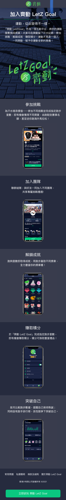

# Letzgoal(01 齐跑响应式网站)

<p>
   <h1><a href="https://fish-1256004880.cos.ap-shenzhen-fsi.myqcloud.com/index.html#letzgoal">视频demo</a></h1>
</p>

- [All](#all)
- [Homepage](#homepage)
- [Challenge](#challenge)
- [Achievement](#achievement)
- [Team](#team)
- [Q&A](#q&a)
- [TNC](#tnc)
- [AboutUs](#about-us)
- [WebviewTickets](#webview-tickets)
- [WebviewInfo](#webview-info)

## all

- 整站添加 apple-app-site-association.json、assetlinks.json 使得能通过 universal link 以及 deeplink 跳转到 app
- 页头页脚：头部固定，底部位置随着正文的高度而变化，如果屏幕高度容得下正文+footer，则 footer 固定在页面底部，否则 footer 滚动。具体实现：

```
#css
main {
  min-height: 100vh;
  display: flex;
  flex-direction: column;
}
.container {
  flex: 1;
}
#html
<main>
  <div class="container">
  </div>
  <footer></footer>
</main>
```

### homepage

- 使用 css 媒体查询进行响应式设计
- 电梯导航，通过点击 PC 端右边的按钮，可以跳转到对应的页面
- 使用 branchIO 生成的 URL 配合 qrcode.react 绘制分享二维码，通过点击移动端的按钮或者扫码 PC 端的二维码实现以下功能：
点击或者扫码二维码跳转到 branchIO url，如果已经安装过 app，则进入 app 对应的页面，否则进入 appStore 或者 google play，如果 appStore 或者 google play 没有安装，则跳转到 branchIO 控制台预先设置好的 url
<p align="center">
  
  <br />
  
</p>

### challenge

- 使用 react-truncate 实现文字的折叠与展开功能，本身 react-truncate 不支持中文，最终使用 patch-package 修改支持中文，右边的二维码跟首页的功能一样，都是通过 branchIO 跳转。
- 根据不同的 userAgent（比如 WhatsApp、facebookexternalhit、Twitterbot）, 展示不同的 Metatags
<p align="center">
  
</p>

### achievement

如 challenge 页面

<p align="center">
  
</p>

### team

如 challenge 页面

<p align="center">
  
</p>

### q&a

<p align="center">
  
</p>

### tnc

<p align="center">
  
</p>

### aboutUs

# event-web

<p align="center">
   <h1><a href="https://fish-1256004880.cos.ap-shenzhen-fsi.myqcloud.com/index.html#eventWeb">视频demo</a></h1>
</p>

### webview-tickets

- 使用 sso 单点登录，material-ui 编写页面 UI 组件，redux-form 处理表单数据
<p align="center">
  <video src="https://fish-1256004880.cos.ap-shenzhen-fsi.myqcloud.com/%E9%A1%B9%E7%9B%AE%E8%A7%86%E9%A2%91/event-web.mp4" controls="controls" width="100%" >您的浏览器不支持播放该视频！</video>
  
</p>

### webview-info

- 使用 sso 单点登录，material-ui 编写页面 UI 组件，redux-form 处理表单数据，调用 app 的 interface 进行数据的交互
<p align="center">
  
</p>
